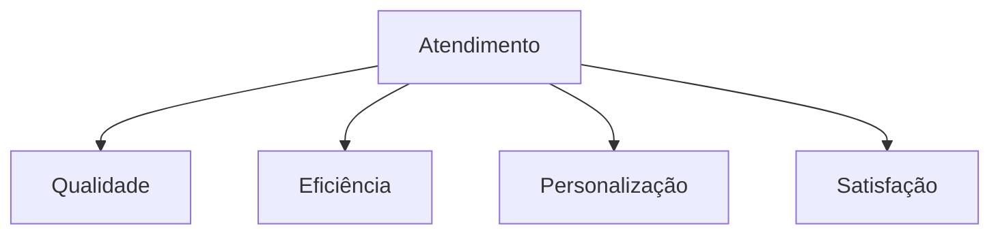
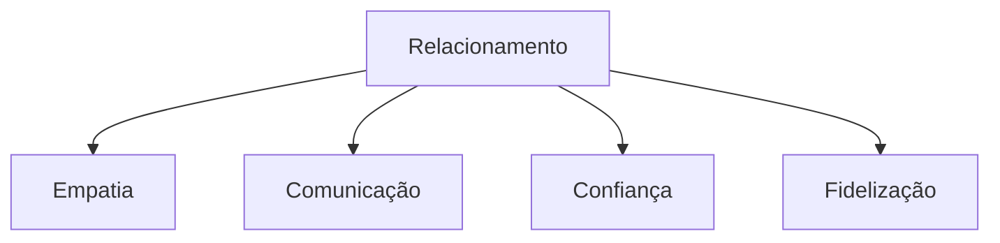
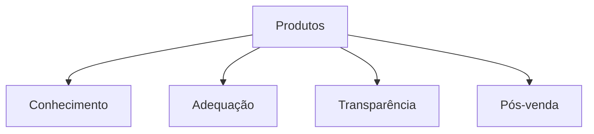
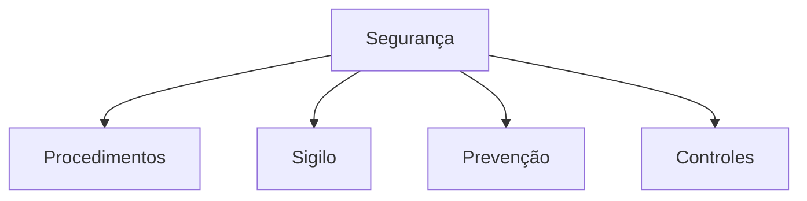

# Simulado 03 - Atendimento Bancário
## Concurso BANESE 2025 - CESGRANRIO

**Tempo Total:** 5 horas
**Total de Questões:** 20
**Controle de Tempo por Bloco:**
- Bloco 1 (Questões 1-5): 75 minutos
- Bloco 2 (Questões 6-10): 75 minutos
- Bloco 3 (Questões 11-15): 75 minutos
- Bloco 4 (Questões 16-20): 75 minutos

### Instruções Gerais
- Leia atentamente cada questão antes de responder
- Marque apenas uma alternativa por questão
- Anote o tempo gasto em cada questão
- Utilize o espaço para rascunho quando necessário
- Faça pausas curtas entre os blocos
- Monitore seu tempo usando o cronômetro

### Dicas para TDAH
- Use o método Pomodoro: 25 minutos de foco, 5 de pausa
- Destaque palavras-chave nas questões
- Faça anotações visuais
- Elimine distrações do ambiente
- Comece pelas questões mais fáceis

### Bloco 1: Atendimento ao Cliente

### Questão 1
**Tempo Estimado:** 3 minutos
**⏱️ Tempo Gasto:** _______
**📝 Revisão:** ☐

Na personalização do atendimento bancário:

a) Use sempre o mesmo script
b) Ignore preferências individuais
c) Adapte-se ao perfil do cliente
d) Mantenha distância profissional
e) Evite contato visual

**Dica TDAH:** Imagine um atendimento sob medida para diferentes perfis.

### Questão 2
**Tempo Estimado:** 3 minutos
**⏱️ Tempo Gasto:** _______
**📝 Revisão:** ☐

Sobre eficiência no atendimento bancário:

a) Priorize velocidade sobre qualidade
b) Ignore procedimentos para agilizar
c) Equilibre agilidade e qualidade
d) Atenda apenas demandas simples
e) Evite usar sistemas digitais

**Dica TDAH:** Visualize um relógio equilibrado com uma balança de qualidade.

### Questão 3
**Tempo Estimado:** 3 minutos
**⏱️ Tempo Gasto:** _______
**📝 Revisão:** ☐

Na gestão da qualidade do atendimento:

a) Foque apenas em metas numéricas
b) Monitore indicadores diversos
c) Ignore feedback dos clientes
d) Evite registros de atendimento
e) Dispense treinamentos regulares

**Dica TDAH:** Imagine um painel de controle com diferentes medidores.

### Questão 4
**Tempo Estimado:** 3 minutos
**⏱️ Tempo Gasto:** _______
**📝 Revisão:** ☐

O gerenciamento do tempo no atendimento requer:

a) Atender apenas um cliente por vez
b) Ignorar clientes em espera
c) Organização e priorização
d) Eliminar pausas entre atendimentos
e) Acelerar todos os processos

**Dica TDAH:** Visualize uma agenda bem organizada com diferentes prioridades.

### Questão 5
**Tempo Estimado:** 3 minutos
**⏱️ Tempo Gasto:** _______
**📝 Revisão:** ☐

Para garantir a satisfação do cliente:

a) Prometa sempre resultados imediatos
b) Evite contato após o atendimento
c) Acompanhe e monitore a experiência
d) Ignore reclamações pequenas
e) Transfira todas as demandas

**Dica TDAH:** Imagine um termômetro medindo a satisfação do cliente.

### Bloco 2: Relacionamento com o Cliente

### Questão 6
**Tempo Estimado:** 3 minutos
**⏱️ Tempo Gasto:** _______
**📝 Revisão:** ☐

Na construção da empatia com o cliente:

a) Mantenha distância emocional
b) Ignore contexto pessoal
c) Compreenda a perspectiva do cliente
d) Evite envolvimento com problemas
e) Use sempre linguagem técnica

**Dica TDAH:** Imagine-se nos sapatos do cliente.

### Questão 7
**Tempo Estimado:** 3 minutos
**⏱️ Tempo Gasto:** _______
**📝 Revisão:** ☐

A comunicação efetiva requer:

a) Uso constante de termos técnicos
b) Clareza e objetividade
c) Omissão de informações negativas
d) Pressa nas explicações
e) Formalidade extrema

**Dica TDAH:** Visualize uma ponte clara entre você e o cliente.

### Questão 8
**Tempo Estimado:** 3 minutos
**⏱️ Tempo Gasto:** _______
**📝 Revisão:** ☐

Na resolução de conflitos:

a) Transfira imediatamente a demanda
b) Ignore reclamações repetitivas
c) Escute e busque soluções
d) Evite registrar ocorrências
e) Culpe outros setores

**Dica TDAH:** Imagine uma escada onde cada degrau é uma etapa da solução.

### Questão 9
**Tempo Estimado:** 3 minutos
**⏱️ Tempo Gasto:** _______
**📝 Revisão:** ☐

Para fidelizar clientes:

a) Foque apenas em vendas
b) Ignore histórico de relacionamento
c) Construa relacionamento duradouro
d) Evite contatos proativos
e) Priorize resultados imediatos

**Dica TDAH:** Visualize uma árvore crescendo forte com o tempo.

### Questão 10
**Tempo Estimado:** 3 minutos
**⏱️ Tempo Gasto:** _______
**📝 Revisão:** ☐

O feedback ao cliente deve ser:

a) Sempre positivo
b) Evitado quando possível
c) Construtivo e claro
d) Apenas quando solicitado
e) Delegado a outros setores

**Dica TDAH:** Imagine um espelho refletindo informações claras.

### Bloco 3: Produtos e Serviços

### Questão 11
**Tempo Estimado:** 3 minutos
**⏱️ Tempo Gasto:** _______
**📝 Revisão:** ☐

Sobre conhecimento de produtos:

a) Memorize apenas preços
b) Ignore características técnicas
c) Domine detalhes e benefícios
d) Foque em um único produto
e) Evite comparações

**Dica TDAH:** Imagine uma biblioteca organizada de produtos.

### Questão 12
**Tempo Estimado:** 3 minutos
**⏱️ Tempo Gasto:** _______
**📝 Revisão:** ☐

Na adequação de produtos ao cliente:

a) Ofereça o mesmo para todos
b) Ignore perfil financeiro
c) Analise necessidades específicas
d) Priorize produtos mais caros
e) Evite análise detalhada

**Dica TDAH:** Visualize um quebra-cabeça onde cada peça se encaixa perfeitamente.

### Questão 13
**Tempo Estimado:** 3 minutos
**⏱️ Tempo Gasto:** _______
**📝 Revisão:** ☐

A transparência na venda exige:

a) Omitir taxas e custos
b) Informar apenas vantagens
c) Apresentar informações completas
d) Minimizar riscos existentes
e) Evitar documentação

**Dica TDAH:** Imagine um vidro totalmente transparente sem manchas.

### Questão 14
**Tempo Estimado:** 3 minutos
**⏱️ Tempo Gasto:** _______
**📝 Revisão:** ☐

Na venda consultiva:

a) Pressione para decisão rápida
b) Ignore dúvidas do cliente
c) Oriente e esclareça dúvidas
d) Foque apenas no fechamento
e) Evite explicações detalhadas

**Dica TDAH:** Visualize-se como um professor paciente explicando cada detalhe.

### Questão 15
**Tempo Estimado:** 3 minutos
**⏱️ Tempo Gasto:** _______
**📝 Revisão:** ☐

O pós-venda deve:

a) Ser evitado sempre
b) Ocorrer apenas em problemas
c) Acompanhar satisfação do cliente
d) Focar em novas vendas
e) Ignorar feedback negativo

**Dica TDAH:** Imagine um ciclo contínuo de atendimento e acompanhamento.

### Bloco 4: Segurança e Compliance

### Questão 16
**Tempo Estimado:** 3 minutos
**⏱️ Tempo Gasto:** _______
**📝 Revisão:** ☐

Sobre procedimentos de segurança:

a) São opcionais em rotinas simples
b) Devem ser sempre seguidos
c) Podem ser adaptados livremente
d) Aplicam-se só a grandes valores
e) São desnecessários no dia a dia

**Dica TDAH:** Visualize um manual de instruções preciso e detalhado.

### Questão 17
**Tempo Estimado:** 3 minutos
**⏱️ Tempo Gasto:** _______
**📝 Revisão:** ☐

O sigilo bancário:

a) É opcional em pequenas operações
b) Aplica-se a todas as informações
c) Vale só para contas ativas
d) Pode ser flexibilizado
e) Depende do valor envolvido

**Dica TDAH:** Imagine um cofre protegendo todas as informações.

### Questão 18
**Tempo Estimado:** 3 minutos
**⏱️ Tempo Gasto:** _______
**📝 Revisão:** ☐

Na prevenção a fraudes:

a) Confie em todos os documentos
b) Ignore sinais de alerta
c) Mantenha atenção constante
d) Dispense verificações extras
e) Aceite justificativas simples

**Dica TDAH:** Visualize uma lupa examinando cada detalhe.

### Questão 19
**Tempo Estimado:** 3 minutos
**⏱️ Tempo Gasto:** _______
**📝 Revisão:** ☐

Os controles internos servem para:

a) Burocratizar processos
b) Dificultar o atendimento
c) Garantir conformidade
d) Atrasar operações
e) Gerar trabalho extra

**Dica TDAH:** Imagine um sistema de engrenagens funcionando em harmonia.

### Questão 20
**Tempo Estimado:** 3 minutos
**⏱️ Tempo Gasto:** _______
**📝 Revisão:** ☐

Sobre normas bancárias:

a) São apenas sugestões
b) Devem ser sempre cumpridas
c) Valem só para gerentes
d) Podem ser ignoradas
e) São temporárias

**Dica TDAH:** Visualize um conjunto de regras formando uma estrutura sólida.

### Distribuição dos Temas
1. Atendimento ao Cliente: Questões 1-5
   - Personalização
   - Eficiência
   - Qualidade
   - Gestão de Tempo
   - Satisfação

2. Relacionamento com o Cliente: Questões 6-10
   - Empatia
   - Comunicação
   - Resolução de Conflitos
   - Fidelização
   - Feedback

3. Produtos e Serviços: Questões 11-15
   - Conhecimento do Portfólio
   - Adequação ao Cliente
   - Transparência
   - Venda Consultiva
   - Pós-venda

4. Segurança e Compliance: Questões 16-20
   - Procedimentos
   - Sigilo
   - Prevenção
   - Controles
   - Normas

### Gabarito Comentado
[Incluir gabarito detalhado com explicações para cada questão]