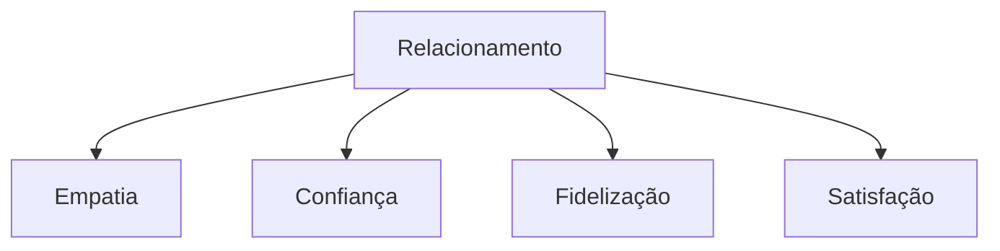
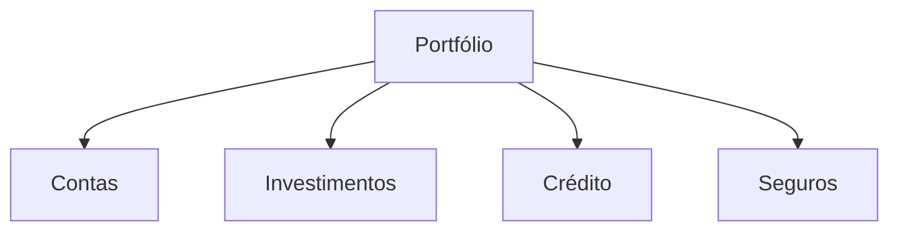
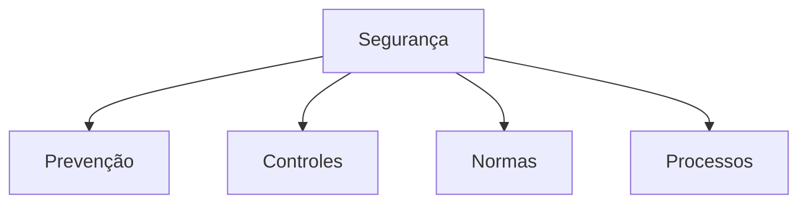

# Simulado 02 - Atendimento Bancário
## Concurso BANESE 2025 - CESGRANRIO

**Tempo Total:** 5 horas
**Total de Questões:** 20
**Controle de Tempo por Bloco:**
- Bloco 1 (Questões 1-5): 75 minutos
- Bloco 2 (Questões 6-10): 75 minutos
- Bloco 3 (Questões 11-15): 75 minutos
- Bloco 4 (Questões 16-20): 75 minutos

### Instruções Gerais
- Leia atentamente cada questão antes de responder
- Marque apenas uma alternativa por questão
- Anote o tempo gasto em cada questão
- Utilize o espaço para rascunho quando necessário
- Faça pausas curtas entre os blocos
- Monitore seu tempo usando o cronômetro

### Dicas para TDAH
- Use o método Pomodoro: 25 minutos de foco, 5 de pausa
- Destaque palavras-chave nas questões
- Faça anotações visuais
- Elimine distrações do ambiente
- Comece pelas questões mais fáceis

### Dicas Gerais para TDAH
- Faça pausas curtas a cada 25 minutos
- Use cores diferentes para marcar pontos importantes
- Mantenha água e lanches leves por perto
- Utilize os espaços para anotações
- Monitore seu tempo em cada bloco

### Controle de Tempo
📊 Diagrama 1: Distribuição do Tempo
- Leitura inicial: 30 min
- Resolução: 3h30
- Revisão: 1h

### Instruções
- Leia atentamente cada questão antes de responder
- Marque apenas uma alternativa por questão
- Anote o tempo gasto em cada questão
- Utilize o espaço para rascunho quando necessário

### Bloco 1 - Qualidade no Atendimento
**Dica TDAH para este bloco:** Visualize cada situação de atendimento
📊 Diagrama 2: Fluxo de Atendimento Bancário

### Questão 1
**Tempo Estimado:** 3 minutos
**⏱️ Tempo Gasto:** _______
**📝 Revisão:** ☐
**🔍 Anotações:** ________________________

Sobre excelência no atendimento bancário:

a) É responsabilidade exclusiva dos gerentes
b) Depende apenas de sistemas modernos
c) Envolve todos os funcionários
d) Limita-se ao horário comercial
e) Aplica-se só a clientes especiais

**Gabarito: C**

**Explicação Detalhada:**
A excelência no atendimento bancário é uma responsabilidade compartilhada por todos os funcionários da instituição. Cada colaborador, desde o segurança até o gerente, tem papel fundamental na experiência do cliente.

**Dica de Estudo:**
- Revise o conceito de atendimento integrado
- Pratique exemplos de trabalho em equipe
- Memorize os pilares do atendimento de qualidade

### Questão 4
**Tempo Estimado:** 3 minutos
**⏱️ Tempo Gasto:** _______
**📝 Revisão:** ☐

Na gestão do tempo de atendimento:

a) Rapidez é mais importante que qualidade
b) O cliente define o ritmo do atendimento
c) Não há necessidade de controle
d) Apenas transações complexas são monitoradas
e) O tempo deve ser equilibrado com qualidade

**Dica TDAH:** Visualize um relógio balanceando tempo e qualidade.

### Questão 5
**Tempo Estimado:** 3 minutos
**⏱️ Tempo Gasto:** _______
**📝 Revisão:** ☐

Sobre a organização do ambiente de trabalho:

a) Não influencia no atendimento
b) É responsabilidade apenas da limpeza
c) Contribui para a eficiência
d) Deve ser ignorada em momentos de pico
e) É secundária ao atendimento

**Dica TDAH:** Imagine um ambiente de trabalho perfeitamente organizado.

### Bloco 2: Relacionamento com o Cliente

### Questão 6
**Tempo Estimado:** 3 minutos
**⏱️ Tempo Gasto:** _______
**📝 Revisão:** ☐

Na construção do relacionamento com o cliente:

a) Foque apenas em vendas
b) Ignore reclamações anteriores
c) Construa confiança gradualmente
d) Evite contato frequente
e) Priorize resultados imediatos

**Dica TDAH:** Imagine construindo uma ponte sólida passo a passo.

### Questão 7
**Tempo Estimado:** 3 minutos
**⏱️ Tempo Gasto:** _______
**📝 Revisão:** ☐

Em relação à fidelização de clientes:

a) É responsabilidade do marketing
b) Depende apenas de preços baixos
c) Requer atenção constante
d) É automática após a primeira venda
e) Não influencia nos resultados

**Dica TDAH:** Visualize um cliente satisfeito retornando várias vezes.

### Questão 8
**Tempo Estimado:** 3 minutos
**⏱️ Tempo Gasto:** _______
**📝 Revisão:** ☐

Na gestão de reclamações:

a) Transfira sempre para outro setor
b) Ignore reclamações repetitivas
c) Trate cada caso como único
d) Evite registros formais
e) Culpe outros departamentos

**Dica TDAH:** Imagine cada reclamação como uma oportunidade de melhoria.

### Questão 9
**Tempo Estimado:** 3 minutos
**⏱️ Tempo Gasto:** _______
**📝 Revisão:** ☐

Sobre a satisfação do cliente:

a) É impossível de medir
b) Depende apenas do preço
c) Deve ser monitorada constantemente
d) É irrelevante para o banco
e) Só importa em grandes transações

**Dica TDAH:** Visualize um termômetro medindo a satisfação do cliente.

### Questão 10
**Tempo Estimado:** 3 minutos
**⏱️ Tempo Gasto:** _______
**📝 Revisão:** ☐

Na comunicação com clientes insatisfeitos:

a) Ignore as reclamações
b) Mantenha a calma e profissionalismo
c) Transfira imediatamente
d) Use tom autoritário
e) Evite documentar a situação

**Dica TDAH:** Imagine-se como um mediador paciente e profissional.

### Bloco 3: Produtos e Serviços

### Questão 11
**Tempo Estimado:** 3 minutos
**⏱️ Tempo Gasto:** _______
**📝 Revisão:** ☐

Na apresentação de produtos bancários:

a) Foque apenas no lucro do banco
b) Ignore o perfil do cliente
c) Apresente todas as características
d) Oculte taxas e custos
e) Evite comparações com concorrentes

**Dica TDAH:** Visualize um catálogo personalizado para cada cliente.

### Questão 12
**Tempo Estimado:** 3 minutos
**⏱️ Tempo Gasto:** _______
**📝 Revisão:** ☐

Em relação aos investimentos:

a) São iguais para todos os clientes
b) Devem ser adaptados ao perfil
c) Ignoram riscos e retornos
d) São apenas para grandes valores
e) Dispensam explicações detalhadas

**Dica TDAH:** Imagine diferentes caminhos de investimento para diferentes perfis.

### Questão 13
**Tempo Estimado:** 3 minutos
**⏱️ Tempo Gasto:** _______
**📝 Revisão:** ☐

Na concessão de crédito:

a) Analise apenas a renda
b) Ignore histórico do cliente
c) Avalie múltiplos fatores
d) Dispense garantias
e) Foque só no valor solicitado

**Dica TDAH:** Visualize uma balança pesando diferentes aspectos do crédito.

### Questão 14
**Tempo Estimado:** 3 minutos
**⏱️ Tempo Gasto:** _______
**📝 Revisão:** ☐

Sobre seguros bancários:

a) São produtos secundários
b) Devem ser explicados detalhadamente
c) Têm cobertura universal
d) Dispensam análise de perfil
e) São todos iguais

**Dica TDAH:** Imagine um guarda-chuva protegendo diferentes situações.

### Questão 15
**Tempo Estimado:** 3 minutos
**⏱️ Tempo Gasto:** _______
**📝 Revisão:** ☐

Na venda de produtos:

a) Pressione para decisão imediata
b) Ignore dúvidas do cliente
c) Respeite o tempo de decisão
d) Oculte informações importantes
e) Evite explicações detalhadas

**Dica TDAH:** Visualize um semáforo respeitando o tempo do cliente.

### Bloco 4: Segurança e Compliance

### Questão 16
**Tempo Estimado:** 3 minutos
**⏱️ Tempo Gasto:** _______
**📝 Revisão:** ☐

Em relação à segurança bancária:

a) É responsabilidade só da TI
b) Todos são responsáveis
c) Aplica-se apenas aos caixas
d) É opcional em pequenas agências
e) Vale só para grandes valores

**Dica TDAH:** Imagine uma corrente onde cada funcionário é um elo importante.

### Questão 17
**Tempo Estimado:** 3 minutos
**⏱️ Tempo Gasto:** _______
**📝 Revisão:** ☐

Na prevenção à fraude:

a) Confie em todos os documentos
b) Ignore sinais de alerta
c) Siga protocolos rigorosos
d) Dispense verificações extras
e) Aceite qualquer justificativa

**Dica TDAH:** Visualize uma lupa examinando cada detalhe.

### Questão 18
**Tempo Estimado:** 3 minutos
**⏱️ Tempo Gasto:** _______
**📝 Revisão:** ☐

Sobre normas e procedimentos:

a) São apenas sugestões
b) Devem ser sempre seguidos
c) Valem só para novatos
d) Podem ser ignorados
e) São desnecessários

**Dica TDAH:** Imagine um manual guiando cada passo do trabalho.

### Questão 19
**Tempo Estimado:** 3 minutos
**⏱️ Tempo Gasto:** _______
**📝 Revisão:** ☐

Na gestão de senhas:

a) Podem ser compartilhadas
b) São estritamente pessoais
c) Valem para sempre
d) Podem ser simples
e) São opcionais

**Dica TDAH:** Visualize uma chave única que só você pode usar.

### Questão 20
**Tempo Estimado:** 3 minutos
**⏱️ Tempo Gasto:** _______
**📝 Revisão:** ☐

Em relação ao sigilo bancário:

a) É opcional para pequenos valores
b) Aplica-se a todas as operações
c) Vale só para contas especiais
d) Depende do tipo de cliente
e) É temporário

**Dica TDAH:** Imagine um cofre protegendo todas as informações.

---

### Distribuição dos Temas
1. Qualidade no Atendimento: Questões 1-5
   - Excelência no Atendimento
   - Comunicação
   - Acessibilidade
   - Gestão do Tempo
   - Organização

2. Relacionamento com o Cliente: Questões 6-10
   - Construção de Relacionamento
   - Fidelização
   - Gestão de Reclamações
   - Satisfação
   - Comunicação com Insatisfeitos

3. Produtos e Serviços: Questões 11-15
   - Apresentação de Produtos
   - Investimentos
   - Crédito
   - Seguros
   - Processo de Venda

4. Segurança e Compliance: Questões 16-20
   - Segurança Bancária
   - Prevenção à Fraude
   - Normas e Procedimentos
   - Gestão de Senhas
   - Sigilo Bancário

### Gabarito Comentado
[Incluir gabarito detalhado com explicações para cada questão]