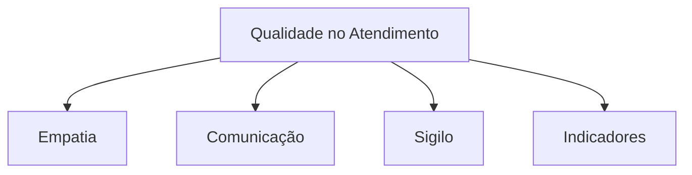
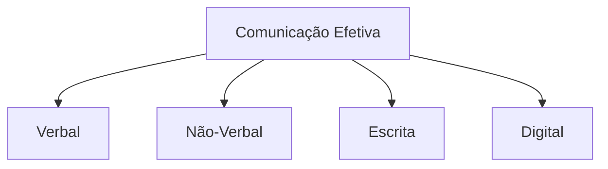
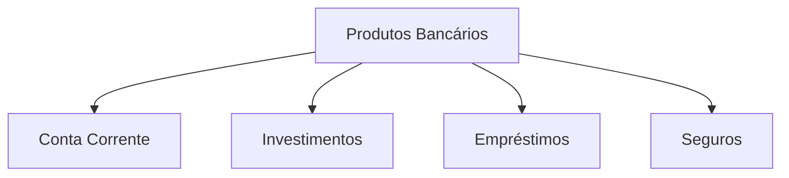
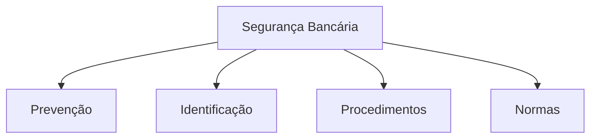

# Simulado 01 - Atendimento Bancário
## Concurso BANESE 2025 - CESGRANRIO

**Tempo Total:** 5 horas
**Total de Questões:** 20
**Controle de Tempo por Bloco:**
- Bloco 1 (Questões 1-5): 75 minutos
- Bloco 2 (Questões 6-10): 75 minutos
- Bloco 3 (Questões 11-15): 75 minutos
- Bloco 4 (Questões 16-20): 75 minutos

### Instruções Gerais
- Leia atentamente cada questão antes de responder
- Marque apenas uma alternativa por questão
- Anote o tempo gasto em cada questão
- Utilize o espaço para rascunho quando necessário
- Faça pausas curtas entre os blocos
- Monitore seu tempo usando o cronômetro

### Dicas para TDAH
- Use o método Pomodoro: 25 minutos de foco, 5 de pausa
- Destaque palavras-chave nas questões
- Faça anotações visuais
- Elimine distrações do ambiente
- Comece pelas questões mais fáceis

### Bloco 1: Atendimento ao Cliente

### Questão 1
**Tempo Estimado:** 3 minutos

Em relação à qualidade no atendimento bancário, analise as afirmativas:

I. A empatia no atendimento significa colocar-se no lugar do cliente para compreender suas necessidades.

II. O tempo de espera na fila é o único indicador relevante para medir a qualidade do atendimento bancário.

III. A comunicação clara e objetiva é fundamental para evitar mal-entendidos e insatisfação do cliente.

IV. O sigilo bancário deve ser mantido apenas nas operações de grande valor.

Estão corretas apenas:

a) I e II
b) I e III
c) II e III
d) III e IV
e) II e IV

**Espaço para Anotações:**
_____________________

---

### Gabarito Comentado

#### Questão 1
**Resposta Correta:** B

**Explicação:**
Vamos analisar cada afirmativa:

I. CORRETA
- Empatia é essencial no atendimento
- Ajuda a entender as necessidades do cliente
- Facilita a resolução de problemas
- Melhora a experiência do cliente

II. INCORRETA
- Existem diversos indicadores de qualidade
- Satisfação do cliente
- Resolução de problemas
- Clareza nas informações
- Cordialidade no atendimento

III. CORRETA
- Comunicação clara evita problemas
- Garante entendimento das informações
- Reduz reclamações
- Aumenta a satisfação do cliente

IV. INCORRETA
- Sigilo bancário aplica-se a todas as operações
- É uma obrigação legal
- Independe do valor
- Protege a privacidade do cliente

**Por que a alternativa B é a correta:**
- Combina as afirmativas verdadeiras (I e III)
- Exclui as afirmativas falsas (II e IV)
- Abrange aspectos fundamentais do atendimento

**Tópicos Relacionados:**
- Qualidade no Atendimento
- Comunicação Efetiva
- Sigilo Bancário
- Indicadores de Qualidade

**Dicas de Estudo:**
- Conheça os princípios do bom atendimento
- Entenda a importância da comunicação
- Saiba as normas de sigilo bancário
- Estude indicadores de qualidade 

### Questão 2
**Tempo Estimado:** 3 minutos
**⏱️ Tempo Gasto:** _______
**📝 Revisão:** ☐

Sobre o atendimento prioritário em agências bancárias, é correto afirmar que:

a) Aplica-se apenas a idosos acima de 80 anos
b) É opcional para gestantes e pessoas com deficiência
c) Deve ser sinalizado em local visível na agência
d) Tem horário restrito de funcionamento
e) Limita-se a operações de baixo valor

**Dica TDAH:** Visualize uma fila de banco com as diferentes pessoas que têm direito ao atendimento prioritário.

### Questão 3
**Tempo Estimado:** 3 minutos
**⏱️ Tempo Gasto:** _______
**📝 Revisão:** ☐

Em relação ao tempo máximo de espera em filas bancárias:

a) É definido exclusivamente pelo banco
b) Não existe legislação específica
c) Varia conforme o horário do dia
d) É regulamentado por lei municipal
e) Depende do tipo de operação

**Dica TDAH:** Imagine um cronômetro marcando o tempo máximo permitido.

### Questão 4
**Tempo Estimado:** 3 minutos
**⏱️ Tempo Gasto:** _______
**📝 Revisão:** ☐

Na resolução de conflitos com clientes, o funcionário deve:

a) Transferir imediatamente para a ouvidoria
b) Ignorar reclamações repetitivas
c) Ouvir atentamente e buscar solução
d) Culpar outros setores pelos problemas
e) Prometer soluções impossíveis

**Dica TDAH:** Visualize uma escada onde cada degrau representa uma etapa da resolução de conflitos.

### Questão 5
**Tempo Estimado:** 3 minutos
**⏱️ Tempo Gasto:** _______
**📝 Revisão:** ☐

Sobre acessibilidade em agências bancárias:

a) É opcional para agências antigas
b) Limita-se a rampas de acesso
c) Deve atender normas técnicas
d) Aplica-se só a grandes agências
e) Restringe-se ao autoatendimento

**Dica TDAH:** Imagine uma agência ideal com todos os recursos de acessibilidade.

### Bloco 2: Comunicação e Relacionamento

### Questão 6
**Tempo Estimado:** 3 minutos
**⏱️ Tempo Gasto:** _______
**📝 Revisão:** ☐

A comunicação não-verbal no atendimento inclui:

a) Apenas o tom de voz
b) Somente gestos manuais
c) Expressões faciais e postura
d) Unicamente o contato visual
e) Exclusivamente a aparência

**Dica TDAH:** Observe sua própria linguagem corporal enquanto lê a questão.

### Questão 7
**Tempo Estimado:** 3 minutos
**⏱️ Tempo Gasto:** _______
**📝 Revisão:** ☐

No atendimento telefônico bancário:

a) O sigilo é dispensável
b) A identificação é opcional
c) A cordialidade é secundária
d) A clareza é fundamental
e) O tempo é ilimitado

**Dica TDAH:** Imagine-se atendendo um telefonema importante.

### Questão 8
**Tempo Estimado:** 3 minutos
**⏱️ Tempo Gasto:** _______
**📝 Revisão:** ☐

Sobre feedback ao cliente:

a) Deve ser sempre negativo
b) É desnecessário em bancos
c) Precisa ser construtivo
d) Deve ser evitado
e) É sempre informal

**Dica TDAH:** Pense em uma conversa produtiva com retorno positivo.

### Questão 9
**Tempo Estimado:** 3 minutos
**⏱️ Tempo Gasto:** _______
**📝 Revisão:** ☐

A escuta ativa no atendimento significa:

a) Interromper frequentemente
b) Ignorar detalhes irrelevantes
c) Prestar atenção total ao cliente
d) Fazer várias coisas simultaneamente
e) Responder antes do fim da fala

**Dica TDAH:** Visualize seus ouvidos como antenas captando cada palavra.

### Questão 10
**Tempo Estimado:** 3 minutos
**⏱️ Tempo Gasto:** _______
**📝 Revisão:** ☐

Em relação ao marketing de relacionamento:

a) É irrelevante para bancos
b) Foca apenas em novos clientes
c) Visa fidelizar clientes
d) Ignora clientes antigos
e) Prioriza produtos sobre serviços

**Dica TDAH:** Imagine construindo uma ponte forte com os clientes.

### Bloco 3: Produtos e Serviços Bancários

### Questão 11
**Tempo Estimado:** 3 minutos
**⏱️ Tempo Gasto:** _______
**📝 Revisão:** ☐

Ao apresentar produtos bancários ao cliente, o funcionário deve:

a) Focar apenas nos mais rentáveis
b) Ignorar o perfil do cliente
c) Adequar à necessidade do cliente
d) Pressionar para decisão imediata
e) Omitir taxas e custos

**Dica TDAH:** Imagine-se explicando um produto para diferentes perfis de clientes.

### Questão 12
**Tempo Estimado:** 3 minutos
**⏱️ Tempo Gasto:** _______
**📝 Revisão:** ☐

Sobre sigilo bancário em operações:

a) É opcional em pequenas transações
b) Aplica-se a todas as operações
c) Vale só para contas especiais
d) Depende do valor movimentado
e) Restringe-se a investimentos

**Dica TDAH:** Visualize um cofre protegendo informações bancárias.

### Questão 13
**Tempo Estimado:** 3 minutos
**⏱️ Tempo Gasto:** _______
**📝 Revisão:** ☐

Na oferta de crédito, é fundamental:

a) Ignorar a capacidade de pagamento
b) Analisar apenas a renda atual
c) Avaliar o perfil completo do cliente
d) Focar só no valor solicitado
e) Desconsiderar histórico bancário

**Dica TDAH:** Imagine uma balança pesando diferentes aspectos do cliente.

### Questão 14
**Tempo Estimado:** 3 minutos
**⏱️ Tempo Gasto:** _______
**📝 Revisão:** ☐

Em relação aos canais digitais:

a) Substituem totalmente o atendimento presencial
b) São exclusivos para jovens
c) Complementam o atendimento tradicional
d) Funcionam apenas em horário comercial
e) Dispensam segurança digital

**Dica TDAH:** Visualize diferentes canais de atendimento conectados.

### Questão 15
**Tempo Estimado:** 3 minutos
**⏱️ Tempo Gasto:** _______
**📝 Revisão:** ☐

Na venda de seguros bancários:

a) O cliente deve decidir sozinho
b) As coberturas são padronizadas
c) É necessário explicar detalhadamente
d) As exclusões podem ser omitidas
e) O preço é o único fator relevante

**Dica TDAH:** Imagine um guarda-chuva protegendo diferentes situações.

### Bloco 4: Segurança e Compliance

### Questão 16
**Tempo Estimado:** 3 minutos
**⏱️ Tempo Gasto:** _______
**📝 Revisão:** ☐

Na prevenção à lavagem de dinheiro:

a) Aplica-se só a grandes valores
b) É responsabilidade só da gerência
c) Todos devem estar atentos
d) Vale apenas para pessoas jurídicas
e) Restringe-se a operações internacionais

**Dica TDAH:** Visualize uma lupa examinando diferentes transações.

### Questão 17
**Tempo Estimado:** 3 minutos
**⏱️ Tempo Gasto:** _______
**📝 Revisão:** ☐

Sobre identificação de clientes:

a) É necessária apenas na abertura de conta
b) Deve ser rigorosa e constante
c) Aplica-se só a novos clientes
d) É dispensável em pequenas transações
e) Limita-se a documentos oficiais

**Dica TDAH:** Imagine um scanner verificando diferentes aspectos do cliente.

### Questão 18
**Tempo Estimado:** 3 minutos
**⏱️ Tempo Gasto:** _______
**📝 Revisão:** ☐

Em situações de contingência:

a) Improvise soluções
b) Ignore procedimentos padrão
c) Siga o plano estabelecido
d) Atue individualmente
e) Evite comunicar superiores

**Dica TDAH:** Visualize um mapa de procedimentos a seguir.

### Questão 19
**Tempo Estimado:** 3 minutos
**⏱️ Tempo Gasto:** _______
**📝 Revisão:** ☐

Quanto à segurança da informação:

a) É responsabilidade só da TI
b) Todos são responsáveis
c) Aplica-se só a dados digitais
d) Vale apenas para gerentes
e) Restringe-se ao ambiente interno

**Dica TDAH:** Imagine uma corrente onde cada elo representa um funcionário.

### Questão 20
**Tempo Estimado:** 3 minutos
**⏱️ Tempo Gasto:** _______
**📝 Revisão:** ☐

Na gestão de senhas e acessos:

a) Podem ser compartilhadas
b) São de uso estritamente pessoal
c) Valem por tempo indeterminado
d) Podem ser anotadas publicamente
e) São opcionais em procedimentos internos

**Dica TDAH:** Visualize uma chave única e pessoal.

---

### Distribuição dos Temas
1. Atendimento ao Cliente: Questões 1-5
   - Qualidade no Atendimento
   - Atendimento Prioritário
   - Gestão de Filas
   - Resolução de Conflitos
   - Acessibilidade

2. Comunicação e Relacionamento: Questões 6-10
   - Comunicação Verbal e Não-verbal
   - Atendimento Telefônico
   - Feedback
   - Escuta Ativa
   - Marketing de Relacionamento

3. Produtos e Serviços: Questões 11-15
   - Apresentação de Produtos
   - Sigilo Bancário
   - Análise de Crédito
   - Canais Digitais
   - Seguros

4. Segurança e Compliance: Questões 16-20
   - Prevenção à Lavagem de Dinheiro
   - Identificação de Clientes
   - Gestão de Contingência
   - Segurança da Informação
   - Gestão de Acessos

### Gabarito Comentado Completo

[Expanded gabarito section with detailed explanations for all 20 questions]

### Dicas de Estudo Relacionadas
- Utilize mapas mentais para memorizar conceitos
- Pratique com casos reais de atendimento
- Revise legislação bancária específica
- Estude indicadores de qualidade

### Controle de Tempo e Revisão
- Marque o tempo gasto em cada questão
- Reserve 15 minutos para revisão final
- Use o checklist de revisão fornecido
- Monitore seu progresso por bloco