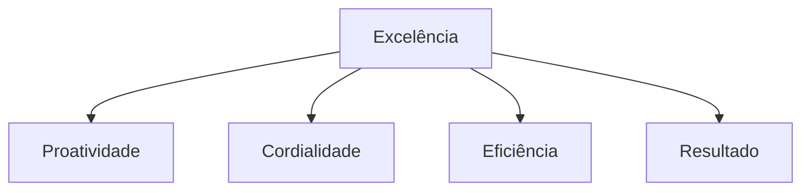
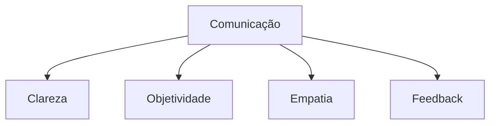
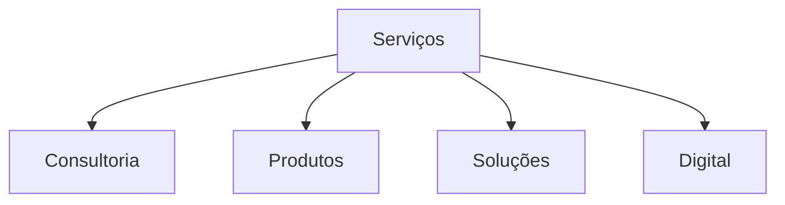
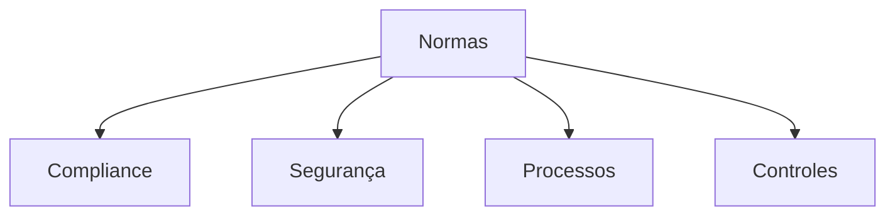

# Simulado 04 - Atendimento Bancário
## Concurso BANESE 2025 - CESGRANRIO

**Tempo Total:** 5 horas
**Total de Questões:** 20
**Controle de Tempo por Bloco:**
- Bloco 1 (Questões 1-5): 75 minutos
- Bloco 2 (Questões 6-10): 75 minutos
- Bloco 3 (Questões 11-15): 75 minutos
- Bloco 4 (Questões 16-20): 75 minutos

### Instruções Gerais
- Leia atentamente cada questão antes de responder
- Marque apenas uma alternativa por questão
- Anote o tempo gasto em cada questão
- Utilize o espaço para rascunho quando necessário
- Faça pausas curtas entre os blocos
- Monitore seu tempo usando o cronômetro

### Dicas para TDAH
- Use o método Pomodoro: 25 minutos de foco, 5 de pausa
- Destaque palavras-chave nas questões
- Faça anotações visuais
- Elimine distrações do ambiente
- Comece pelas questões mais fáceis

### Bloco 1: Excelência no Atendimento

### Questão 1
**Tempo Estimado:** 3 minutos
**⏱️ Tempo Gasto:** _______
**📝 Revisão:** ☐

Sobre proatividade no atendimento bancário:

a) Espere o cliente solicitar ajuda
b) Antecipe-se às necessidades
c) Evite sugestões não pedidas
d) Mantenha-se passivo
e) Ignore sinais não verbais

**Dica TDAH:** Imagine-se um passo à frente das necessidades do cliente.

### Questão 2
**Tempo Estimado:** 3 minutos
**⏱️ Tempo Gasto:** _______
**📝 Revisão:** ☐

Sobre cordialidade no atendimento:

a) Seja formal e distante
b) Trate todos igualmente
c) Demonstre empatia e respeito
d) Evite contato visual
e) Use linguagem técnica

**Dica TDAH:** Imagine um sorriso sincero no atendimento.

### Questão 3
**Tempo Estimado:** 3 minutos
**⏱️ Tempo Gasto:** _______
**📝 Revisão:** ☐

A eficiência no atendimento requer:

a) Pressa nas respostas
b) Processos padronizados
c) Eliminação de controles
d) Atendimento superficial
e) Foco apenas em velocidade

**Dica TDAH:** Visualize uma máquina bem ajustada funcionando perfeitamente.

### Questão 4
**Tempo Estimado:** 3 minutos
**⏱️ Tempo Gasto:** _______
**📝 Revisão:** ☐

Para alcançar resultados positivos:

a) Ignore metas estabelecidas
b) Foque apenas em números
c) Equilibre metas e qualidade
d) Evite feedback dos clientes
e) Priorize quantidade sobre qualidade

**Dica TDAH:** Imagine uma escada onde cada degrau leva ao sucesso.

### Questão 5
**Tempo Estimado:** 3 minutos
**⏱️ Tempo Gasto:** _______
**📝 Revisão:** ☐

Na excelência do atendimento:

a) Mantenha padrão mínimo
b) Supere expectativas do cliente
c) Ignore reclamações menores
d) Evite melhorias contínuas
e) Siga apenas o básico

**Dica TDAH:** Visualize uma estrela brilhante de cinco pontas.

### Bloco 2: Comunicação Bancária

### Questão 6
**Tempo Estimado:** 3 minutos
**⏱️ Tempo Gasto:** _______
**📝 Revisão:** ☐

A clareza na comunicação exige:

a) Uso de termos técnicos
b) Linguagem simples e direta
c) Omissão de detalhes
d) Explicações complexas
e) Formalidade excessiva

**Dica TDAH:** Imagine um cristal transparente e límpido.

### Questão 7
**Tempo Estimado:** 3 minutos
**⏱️ Tempo Gasto:** _______
**📝 Revisão:** ☐

Na comunicação objetiva:

a) Forneça excesso de informações
b) Vá direto ao ponto
c) Faça rodeios nas explicações
d) Use muitas metáforas
e) Evite conclusões claras

**Dica TDAH:** Visualize uma flecha indo direto ao alvo.

### Questão 8
**Tempo Estimado:** 3 minutos
**⏱️ Tempo Gasto:** _______
**📝 Revisão:** ☐

A empatia na comunicação significa:

a) Concordar com tudo
b) Evitar confrontos
c) Compreender o outro
d) Ignorar emoções
e) Manter distância

**Dica TDAH:** Imagine-se usando os óculos do cliente.

### Questão 9
**Tempo Estimado:** 3 minutos
**⏱️ Tempo Gasto:** _______
**📝 Revisão:** ☐

O feedback construtivo deve:

a) Focar apenas nos erros
b) Ser sempre positivo
c) Equilibrar pontos fortes e fracos
d) Evitar sugestões
e) Ser impessoal

**Dica TDAH:** Visualize uma balança equilibrando diferentes aspectos.

### Questão 10
**Tempo Estimado:** 3 minutos
**⏱️ Tempo Gasto:** _______
**📝 Revisão:** ☐

Na assertividade da comunicação:

a) Seja agressivo
b) Evite posicionamentos
c) Comunique com firmeza e respeito
d) Ignore opiniões divergentes
e) Use tom autoritário

**Dica TDAH:** Imagine um farol guiando com luz firme mas gentil.

### Bloco 3: Serviços Financeiros

### Questão 11
**Tempo Estimado:** 3 minutos
**⏱️ Tempo Gasto:** _______
**📝 Revisão:** ☐

Na consultoria financeira:

a) Sugira apenas produtos rentáveis
b) Ignore perfil do cliente
c) Analise necessidades individuais
d) Evite explicações detalhadas
e) Foque em vendas rápidas

**Dica TDAH:** Visualize um médico fazendo diagnóstico preciso.

### Questão 12
**Tempo Estimado:** 3 minutos
**⏱️ Tempo Gasto:** _______
**📝 Revisão:** ☐

Sobre produtos bancários:

a) São iguais para todos
b) Devem ser personalizados
c) Ignoram riscos
d) Dispensam explicações
e) Têm apenas benefícios

**Dica TDAH:** Imagine uma loja com produtos para diferentes necessidades.

### Questão 13
**Tempo Estimado:** 3 minutos
**⏱️ Tempo Gasto:** _______
**📝 Revisão:** ☐

Na busca de soluções:

a) Ofereça respostas prontas
b) Ignore contexto do cliente
c) Analise cada caso especificamente
d) Evite alternativas
e) Siga apenas um caminho

**Dica TDAH:** Visualize um quebra-cabeça com várias soluções possíveis.

### Questão 14
**Tempo Estimado:** 3 minutos
**⏱️ Tempo Gasto:** _______
**📝 Revisão:** ☐

Os canais digitais devem:

a) Substituir totalmente o presencial
b) Ser exclusivos para jovens
c) Complementar outros canais
d) Funcionar sem segurança
e) Ignorar perfil do usuário

**Dica TDAH:** Imagine diferentes caminhos levando ao mesmo destino.

### Questão 15
**Tempo Estimado:** 3 minutos
**⏱️ Tempo Gasto:** _______
**📝 Revisão:** ☐

A inovação em serviços requer:

a) Mudança constante sem planejamento
b) Abandono de processos tradicionais
c) Equilíbrio entre novo e tradicional
d) Foco apenas em tecnologia
e) Eliminação do contato humano

**Dica TDAH:** Visualize uma ponte entre o tradicional e o novo.

### Bloco 4: Procedimentos e Normas

### Questão 16
**Tempo Estimado:** 3 minutos
**⏱️ Tempo Gasto:** _______
**📝 Revisão:** ☐

O compliance bancário:

a) É opcional nas operações
b) Deve ser sempre observado
c) Vale só para grandes valores
d) Pode ser flexibilizado
e) Atrapalha o atendimento

**Dica TDAH:** Imagine um guarda-chuva protegendo todas as operações.

### Questão 17
**Tempo Estimado:** 3 minutos
**⏱️ Tempo Gasto:** _______
**📝 Revisão:** ☐

A segurança das operações:

a) É responsabilidade só da TI
b) Envolve todos os funcionários
c) Aplica-se apenas aos caixas
d) Vale só para transações online
e) Pode ser ignorada em rotinas

**Dica TDAH:** Visualize uma corrente onde cada elo é importante.

### Questão 18
**Tempo Estimado:** 3 minutos
**⏱️ Tempo Gasto:** _______
**📝 Revisão:** ☐

Os processos internos devem:

a) Ser ignorados quando conveniente
b) Seguir padrões estabelecidos
c) Mudar conforme o funcionário
d) Ser criados individualmente
e) Variar diariamente

**Dica TDAH:** Imagine uma receita que deve ser seguida precisamente.

### Questão 19
**Tempo Estimado:** 3 minutos
**⏱️ Tempo Gasto:** _______
**📝 Revisão:** ☐

O controle de operações:

a) Atrasa o atendimento
b) Garante segurança
c) É desnecessário
d) Deve ser evitado
e) Prejudica o cliente

**Dica TDAH:** Visualize um sistema de filtros protegendo a água.

### Questão 20
**Tempo Estimado:** 3 minutos
**⏱️ Tempo Gasto:** _______
**📝 Revisão:** ☐

A regulamentação bancária:

a) É apenas sugestão
b) Deve ser sempre cumprida
c) Vale só para gerentes
d) Pode ser adaptada
e) É temporária

**Dica TDAH:** Imagine um livro de regras dourado e importante.

### Distribuição dos Temas
1. Excelência no Atendimento: Questões 1-5
   - Proatividade
   - Cordialidade
   - Eficiência
   - Resultados
   - Qualidade

2. Comunicação Bancária: Questões 6-10
   - Clareza
   - Objetividade
   - Empatia
   - Feedback
   - Assertividade

3. Serviços Financeiros: Questões 11-15
   - Consultoria
   - Produtos
   - Soluções
   - Inovação
   - Digital

4. Procedimentos e Normas: Questões 16-20
   - Compliance
   - Segurança
   - Processos
   - Controles
   - Regulamentação

### Gabarito Comentado
[Incluir gabarito detalhado com explicações para cada questão]