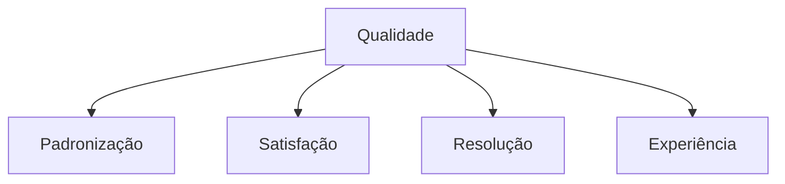
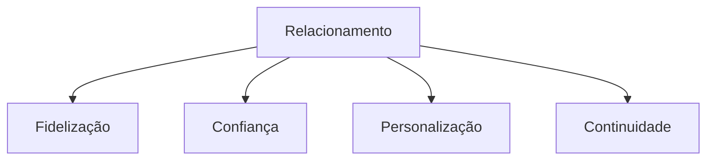
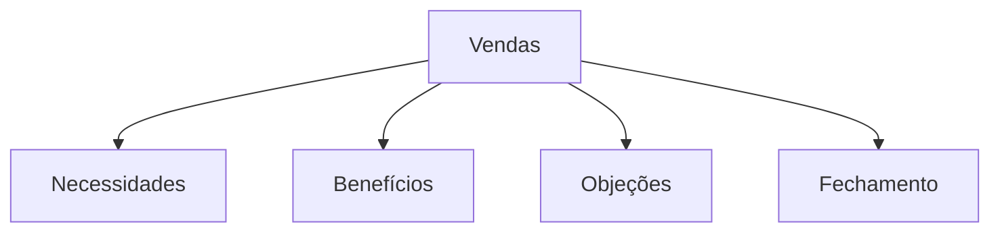
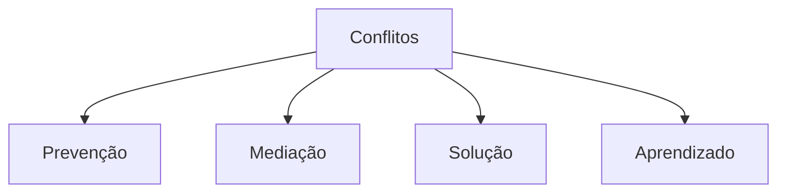

# Simulado 05 - Atendimento Bancário
## Concurso BANESE 2025 - CESGRANRIO

**Tempo Total:** 5 horas
**Total de Questões:** 20
**Controle de Tempo por Bloco:**
- Bloco 1 (Questões 1-5): 75 minutos
- Bloco 2 (Questões 6-10): 75 minutos
- Bloco 3 (Questões 11-15): 75 minutos
- Bloco 4 (Questões 16-20): 75 minutos

### Instruções Gerais
- Leia atentamente cada questão antes de responder
- Marque apenas uma alternativa por questão
- Anote o tempo gasto em cada questão
- Utilize o espaço para rascunho quando necessário
- Faça pausas curtas entre os blocos
- Monitore seu tempo usando o cronômetro

### Dicas para TDAH
- Use o método Pomodoro: 25 minutos de foco, 5 de pausa
- Destaque palavras-chave nas questões
- Faça anotações visuais
- Elimine distrações do ambiente
- Comece pelas questões mais fáceis

### Bloco 1: Qualidade no Atendimento

### Questão 1
**Tempo Estimado:** 3 minutos
**⏱️ Tempo Gasto:** _______
**📝 Revisão:** ☐

A padronização no atendimento bancário:

a) Limita a criatividade do atendente
b) Garante consistência no serviço
c) Impede personalização
d) Torna o atendimento robótico
e) Dificulta a resolução de problemas

**Dica TDAH:** Imagine uma orquestra onde todos seguem a mesma partitura.

### Questão 2
**Tempo Estimado:** 3 minutos
**⏱️ Tempo Gasto:** _______
**📝 Revisão:** ☐

Para garantir a satisfação do cliente:

a) Ignore reclamações pequenas
b) Prometa mais do que pode entregar
c) Atenda às expectativas consistentemente
d) Evite feedback negativo
e) Transfira responsabilidades

**Dica TDAH:** Visualize um cliente sorrindo após um atendimento perfeito.

### Questão 3
**Tempo Estimado:** 3 minutos
**⏱️ Tempo Gasto:** _______
**📝 Revisão:** ☐

Na resolução de problemas:

a) Transfira para outro setor
b) Resolva na primeira interação
c) Adie soluções complexas
d) Ignore casos repetitivos
e) Evite documentação

**Dica TDAH:** Imagine um quebra-cabeça sendo montado rapidamente.

### Questão 4
**Tempo Estimado:** 3 minutos
**⏱️ Tempo Gasto:** _______
**📝 Revisão:** ☐

A experiência do cliente depende de:

a) Apenas tecnologia
b) Somente cordialidade
c) Múltiplos fatores integrados
d) Velocidade exclusivamente
e) Processos isolados

**Dica TDAH:** Visualize uma teia onde todos os pontos se conectam.

### Questão 5
**Tempo Estimado:** 3 minutos
**⏱️ Tempo Gasto:** _______
**📝 Revisão:** ☐

O monitoramento da qualidade deve:

a) Ser realizado anualmente
b) Focar apenas em erros
c) Acontecer continuamente
d) Ignorar feedback positivo
e) Evitar métricas objetivas

**Dica TDAH:** Imagine um radar constantemente ativo.

### Bloco 2: Relacionamento com Cliente

### Questão 6
**Tempo Estimado:** 3 minutos
**⏱️ Tempo Gasto:** _______
**📝 Revisão:** ☐

Para fidelizar clientes é necessário:

a) Oferecer apenas promoções
b) Construir relacionamentos duradouros
c) Ignorar concorrência
d) Focar em vendas rápidas
e) Evitar contato frequente

**Dica TDAH:** Visualize uma árvore crescendo forte com o tempo.

### Questão 7
**Tempo Estimado:** 3 minutos
**⏱️ Tempo Gasto:** _______
**📝 Revisão:** ☐

A confiança do cliente é construída através de:

a) Promessas exageradas
b) Transparência e honestidade
c) Omissão de informações
d) Marketing agressivo
e) Pressão por vendas

**Dica TDAH:** Imagine um aperto de mão firme e sincero.

### Questão 8
**Tempo Estimado:** 3 minutos
**⏱️ Tempo Gasto:** _______
**📝 Revisão:** ☐

Na personalização do atendimento:

a) Use abordagem única
b) Ignore preferências
c) Adapte ao perfil do cliente
d) Padronize todas respostas
e) Evite registros históricos

**Dica TDAH:** Visualize um alfaiate ajustando uma roupa sob medida.

### Questão 9
**Tempo Estimado:** 3 minutos
**⏱️ Tempo Gasto:** _______
**📝 Revisão:** ☐

O acompanhamento pós-atendimento deve:

a) Ser evitado sempre
b) Acontecer sistematicamente
c) Ocorrer raramente
d) Focar só em problemas
e) Ser terceirizado

**Dica TDAH:** Imagine um círculo que nunca se fecha.

### Questão 10
**Tempo Estimado:** 3 minutos
**⏱️ Tempo Gasto:** _______
**📝 Revisão:** ☐

O histórico de relacionamento:

a) É irrelevante
b) Deve ser consultado sempre
c) Atrapalha o atendimento
d) Pode ser descartado
e) Serve só para marketing

**Dica TDAH:** Visualize um livro com todas as páginas importantes.

### Bloco 3: Vendas e Negociação

### Questão 11
**Tempo Estimado:** 3 minutos
**⏱️ Tempo Gasto:** _______
**📝 Revisão:** ☐

A identificação de necessidades:

a) É desnecessária
b) Deve ser superficial
c) Requer análise profunda
d) Atrasa vendas
e) Prejudica resultados

**Dica TDAH:** Imagine um detetive investigando pistas importantes.

### Questão 12
**Tempo Estimado:** 3 minutos
**⏱️ Tempo Gasto:** _______
**📝 Revisão:** ☐

Ao apresentar benefícios:

a) Foque em características técnicas
b) Relacione com necessidades do cliente
c) Ignore limitações
d) Use linguagem complexa
e) Evite comparações

**Dica TDAH:** Visualize uma ponte ligando produto e necessidade.

### Questão 13
**Tempo Estimado:** 3 minutos
**⏱️ Tempo Gasto:** _______
**📝 Revisão:** ☐

No tratamento de objeções:

a) Ignore-as completamente
b) Confronte agressivamente
c) Esclareça com paciência
d) Mude de assunto
e) Pressione o cliente

**Dica TDAH:** Imagine transformando muros em pontes.

### Questão 14
**Tempo Estimado:** 3 minutos
**⏱️ Tempo Gasto:** _______
**📝 Revisão:** ☐

O fechamento da venda deve:

a) Ser forçado sempre
b) Ocorrer naturalmente
c) Ser evitado
d) Acontecer sem acordo
e) Ignorar condições

**Dica TDAH:** Visualize uma peça se encaixando perfeitamente.

### Questão 15
**Tempo Estimado:** 3 minutos
**⏱️ Tempo Gasto:** _______
**📝 Revisão:** ☐

O pós-venda requer:

a) Nenhum contato
b) Acompanhamento estruturado
c) Contato mínimo
d) Terceirização total
e) Automação completa

**Dica TDAH:** Imagine um jardineiro cuidando de suas plantas.

### Bloco 4: Gestão de Conflitos

### Questão 16
**Tempo Estimado:** 3 minutos
**⏱️ Tempo Gasto:** _______
**📝 Revisão:** ☐

Na prevenção de conflitos:

a) Ignore sinais de tensão
b) Antecipe-se aos problemas
c) Evite comunicação
d) Transfira responsabilidade
e) Mantenha distância

**Dica TDAH:** Visualize um para-raios protegendo um edifício.

### Questão 17
**Tempo Estimado:** 3 minutos
**⏱️ Tempo Gasto:** _______
**📝 Revisão:** ☐

A mediação de conflitos exige:

a) Parcialidade clara
b) Neutralidade e equilíbrio
c) Imposição de soluções
d) Evitar diálogo
e) Ignorar contexto

**Dica TDAH:** Imagine uma balança perfeitamente equilibrada.

### Questão 18
**Tempo Estimado:** 3 minutos
**⏱️ Tempo Gasto:** _______
**📝 Revisão:** ☐

Na resolução de conflitos:

a) Imponha sua opinião
b) Busque consenso
c) Ignore partes envolvidas
d) Evite documentação
e) Mantenha o problema

**Dica TDAH:** Visualize um nó sendo desfeito cuidadosamente.

### Questão 19
**Tempo Estimado:** 3 minutos
**⏱️ Tempo Gasto:** _______
**📝 Revisão:** ☐

O aprendizado com conflitos deve:

a) Ser ignorado
b) Gerar melhorias
c) Ser esquecido
d) Ficar restrito
e) Evitar mudanças

**Dica TDAH:** Imagine uma lição sendo escrita em um quadro.

### Questão 20
**Tempo Estimado:** 3 minutos
**⏱️ Tempo Gasto:** _______
**📝 Revisão:** ☐

O registro de conflitos:

a) É desnecessário
b) Deve ser detalhado
c) Atrapalha soluções
d) Pode ser informal
e) É perda de tempo

**Dica TDAH:** Visualize um diário registrando histórias importantes.

### Distribuição dos Temas
1. Qualidade no Atendimento: Questões 1-5
   - Padronização
   - Satisfação
   - Resolução
   - Experiência
   - Monitoramento

2. Relacionamento com Cliente: Questões 6-10
   - Fidelização
   - Confiança
   - Personalização
   - Acompanhamento
   - Histórico

3. Vendas e Negociação: Questões 11-15
   - Necessidades
   - Benefícios
   - Objeções
   - Fechamento
   - Pós-venda

4. Gestão de Conflitos: Questões 16-20
   - Prevenção
   - Mediação
   - Resolução
   - Aprendizado
   - Registro

### Gabarito Comentado
[Incluir gabarito detalhado com explicações para cada questão]